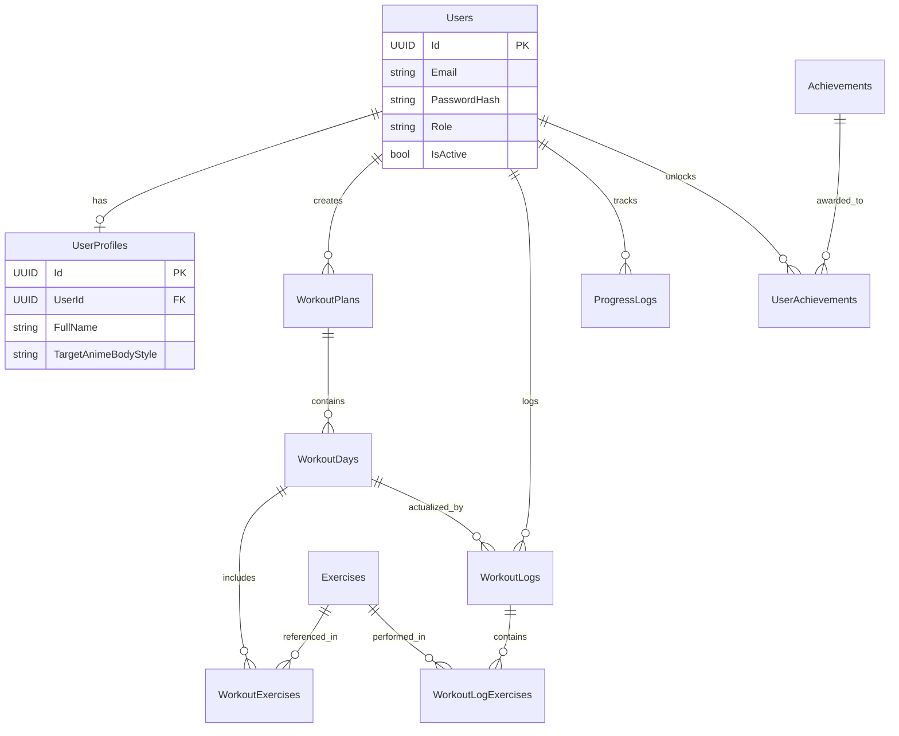

# Thiết Kế Cơ Sở Dữ Liệu (Database Design) - AnimeFit Pro

Tài liệu này mô tả chi tiết thiết kế Cơ Sở Dữ Liệu (CSDL) cho dự án AnimeFit Pro. Thiết kế này được nâng cấp theo tiêu chuẩn hệ thống doanh nghiệp (Enterprise-level), sẵn sàng để triển khai thực tế (từ 0 -> Z), dễ dàng mở rộng và tối ưu hoàn toàn cho C# Entity Framework Core.

## 1. Sơ Đồ Thực Thể Liên Kết (ERD)

Sơ đồ tổng quan thể hiện cấu trúc và mối quan hệ giữa các bảng.

---

## 2. Chi Tiết Các Bảng (Tables Detail)

### 2.1. Authentication & User Management (Quản lý Người Dùng)

**Bảng: `Users`**
Quản lý thông tin xác thực và tài khoản định danh cốt lõi.
- `Id` (UUID) - Primary Key
- `Email` (VARCHAR 255) - Unique, Not Null (Dùng để đăng nhập)
- `PasswordHash` (VARCHAR 255) - Not Null
- `Role` (VARCHAR 50) - 'Admin', 'User' (Mặc định: 'User')
- `IsActive` (BOOLEAN) - Trạng thái hoạt động (Mặc định: True)
- `CreatedAt` (DATETIME)
- `UpdatedAt` (DATETIME)

**Bảng: `UserProfiles`**
Lưu trữ thông tin cá nhân, thể trạng hiện tại và mục tiêu phong cách Anime.
- `Id` (UUID) - Primary Key
- `UserId` (UUID) - Foreign Key -> `Users.Id` (Unique - Quan hệ 1:1)
- `FullName` (VARCHAR 100) - Not Null
- `AvatarUrl` (VARCHAR 500) - Nullable
- `Age` (INT)
- `Gender` (VARCHAR 20) - 'Male', 'Female', 'Other'
- `Height` (DECIMAL 5,2) - Đơn vị: cm
- `Weight` (DECIMAL 5,2) - Đơn vị: kg
- `Goal` (VARCHAR 50) - 'LoseWeight' (Giảm mỡ), 'BuildMuscle' (Tăng cơ), 'GetShredded' (Cắt nét), 'Maintenance' (Duy trì)
- `TrainingLevel` (VARCHAR 50) - 'Beginner', 'Intermediate', 'Advanced'
- `DaysPerWeek` (INT) - Số ngày có thể tập trong tuần
- `TargetAnimeBodyStyle` (VARCHAR 50) - Thể hình mục tiêu: 'Goku' (Bulky/Cơ bắp lớn), 'Levi' (Lean/Săn chắc nhanh nhẹn), 'Baki' (Shredded/Siêu khô), 'Maki' (Toned/Nữ chiến binh), v.v.
- `CreatedAt` (DATETIME)
- `UpdatedAt` (DATETIME)

---

### 2.2. Master Data (Dữ liệu Nền Tảng - Từ Điển)

**Bảng: `Exercises`**
Kho tàng các bài tập gym. Đây là dữ liệu dùng chung (Master Data) không bị chỉnh sửa bởi user bình thường.
- `Id` (UUID) - Primary Key
- `Name` (VARCHAR 100) - Not Null
- `MuscleGroup` (VARCHAR 50) - 'Chest', 'Back', 'Legs', 'Arms', 'Shoulders', 'Core', 'FullBody'
- `SecondaryMuscleGroups` (VARCHAR 255) - Nhóm cơ phụ hỗ trợ (Nullable, dạng comma-separated)
- `Description` (TEXT) - Hướng dẫn chi tiết kỹ thuật
- `Difficulty` (VARCHAR 50) - 'Beginner', 'Intermediate', 'Advanced'
- `ImageUrl` (VARCHAR 500) - Hình ảnh hoặc GIF minh họa chuẩn
- `VideoUrl` (VARCHAR 500) - Link video hướng dẫn (Youtube/S3)
- `AnimeReferenceImageUrl` (VARCHAR 500) - **[Tính năng đặc biệt]** Ảnh/GIF một nhân vật anime đang thực hiện động tác này để tạo động lực.
- `CreatedAt` (DATETIME)
- `UpdatedAt` (DATETIME)

---

### 2.3. Lịch Tập Luyện (Workout Planning)

**Bảng: `WorkoutPlans`**
Kế hoạch tập luyện tổng thể (có thể do AI/Python sinh ra hoặc User tự tạo).
- `Id` (UUID) - Primary Key
- `UserId` (UUID) - Foreign Key -> `Users.Id`
- `PlanName` (VARCHAR 100) - VD: "Hành trình trở thành Super Saiyan 30 Ngày"
- `Goal` (VARCHAR 50) - Mục tiêu lúc tạo lịch
- `TargetAnimeBodyStyle` (VARCHAR 50) - Phong cách anime hướng tới cho lịch này
- `StartDate` (DATETIME)
- `EndDate` (DATETIME) - Nullable
- `IsActive` (BOOLEAN) - Đánh dấu lịch đang áp dụng hiện tại (Chỉ 1 lịch Active tại 1 thời điểm)
- `CreatedAt` (DATETIME)
- `UpdatedAt` (DATETIME)

**Bảng: `WorkoutDays`**
Định nghĩa các buổi tập trong một Kế hoạch.
- `Id` (UUID) - Primary Key
- `WorkoutPlanId` (UUID) - Foreign Key -> `WorkoutPlans.Id`
- `DayNumber` (INT) - Số thứ tự ngày trong tuần/chu kỳ (1, 2, 3...)
- `DayName` (VARCHAR 100) - VD: "Push Day", "Saitama Core Routine", "Phục hồi sức mạnh"
- `FocusMuscle` (VARCHAR 100) - Nhóm cơ tập trung
- `CreatedAt` (DATETIME)

**Bảng: `WorkoutExercises`**
Chi tiết các bài tập cần làm trong một buổi tập cụ thể.
- `Id` (UUID) - Primary Key
- `WorkoutDayId` (UUID) - Foreign Key -> `WorkoutDays.Id`
- `ExerciseId` (UUID) - Foreign Key -> `Exercises.Id`
- `OrderIndex` (INT) - Thứ tự thực hiện bài tập (1, 2, 3...)
- `Sets` (INT) - Số hiệp dự kiến
- `Reps` (VARCHAR 50) - Số lần thực hiện (VD: "8-12", "To Failure", "5x5")
- `RestSeconds` (INT) - Số giây nghỉ giữa các set
- `Notes` (TEXT) - Lưu ý kỹ thuật (VD: "Gồng core như Levi, kiểm soát nhịp thở Nước")
- `CreatedAt` (DATETIME)

---

### 2.4. Theo Dõi & Nhật Ký Thực Tế (Tracking & Workout Logs)

**Bảng: `WorkoutLogs`**
Lưu lại lịch sử mỗi khi User bắt đầu "Start Workout" và hoàn thành buổi tập.
- `Id` (UUID) - Primary Key
- `UserId` (UUID) - Foreign Key -> `Users.Id`
- `WorkoutDayId` (UUID) - Nullable (Nếu user tập một buổi tự do ngoài lịch) -> Khóa ngoại đến `WorkoutDays.Id`
- `StartTime` (DATETIME)
- `EndTime` (DATETIME)
- `TotalVolume` (DECIMAL 10,2) - Tổng khối lượng tạ đã nâng trong buổi (kg) -> Dùng để vẽ chart tiến độ
- `FeelingRating` (INT) - Đánh giá buổi tập từ 1-5 (1: Tệ, 5: Đạt trạng thái Tỉnh Thức/Awakened)
- `Notes` (TEXT) - Cảm nghĩ buổi tập
- `CreatedAt` (DATETIME)

**Bảng: `WorkoutLogExercises`**
Ghi chép chi tiết kết quả thực tế từng Set của mỗi bài tập.
- `Id` (UUID) - Primary Key
- `WorkoutLogId` (UUID) - Foreign Key -> `WorkoutLogs.Id`
- `ExerciseId` (UUID) - Foreign Key -> `Exercises.Id`
- `SetNumber` (INT) - Hiệp số mấy
- `RepsCompleted` (INT) - Số lần thực tế hoàn thành
- `WeightUsed` (DECIMAL 5,2) - Mức tạ thực tế sử dụng (kg)
- `CreatedAt` (DATETIME)

**Bảng: `ProgressLogs`**
Nhật ký theo dõi sự thay đổi của cơ thể (Body Transformation) theo thời gian.
- `Id` (UUID) - Primary Key
- `UserId` (UUID) - Foreign Key -> `Users.Id`
- `Date` (DATETIME) - Ngày ghi nhận
- `Weight` (DECIMAL 5,2) - Cân nặng (kg)
- `BodyFatPercentage` (DECIMAL 5,2) - Tỷ lệ mỡ (%) (Nullable)
- `Chest` (DECIMAL 5,2) - Vòng ngực (cm)
- `Waist` (DECIMAL 5,2) - Vòng eo (cm)
- `Arm` (DECIMAL 5,2) - Vòng tay (cm)
- `Leg` (DECIMAL 5,2) - Vòng đùi (cm)
- `FrontPhotoUrl` (VARCHAR 500) - Ảnh mặt trước
- `BackPhotoUrl` (VARCHAR 500) - Ảnh mặt sau
- `SidePhotoUrl` (VARCHAR 500) - Ảnh góc nghiêng
- `Note` (TEXT)
- `CreatedAt` (DATETIME)

---

### 2.5. Gamification (Hệ Thống Thành Tựu & Huy Hiệu Anime)

Giúp tăng tương tác (Retention Rate) bằng cách trao huy hiệu kiểu game/anime.

**Bảng: `Achievements`**
Danh sách các thành tựu (Master Data).
- `Id` (UUID) - Primary Key
- `Name` (VARCHAR 100) - VD: "Huyết thống Saiyan", "Sức mạnh One Punch"
- `Description` (TEXT) - "Tập đủ 100 cái hít đất, 100 squat, 100 gập bụng trong 1 buổi"
- `BadgeImageUrl` (VARCHAR 500) - Hình ảnh huy hiệu lấp lánh đẹp mắt
- `RequiredCriteria` (VARCHAR 255) - Chuỗi Rule/JSON dùng cho Backend tự động check và trao thưởng
- `CreatedAt` (DATETIME)

**Bảng: `UserAchievements`**
Lưu trữ những thành tựu mà User đã mở khóa.
- `UserId` (UUID) - Foreign Key -> `Users.Id`
- `AchievementId` (UUID) - Foreign Key -> `Achievements.Id`
- `UnlockedAt` (DATETIME) - Thời điểm đạt được
- *Primary Key (Composite Key): `(UserId, AchievementId)`*

---

## 3. Các Chỉ Mục Tối Ưu Hóa (Database Indexes)
Để đảm bảo API phản hồi tốc độ cao dưới 100ms khi dữ liệu lớn:
- `idx_Users_Email`: Unique Index trên `Users.Email` để Login/Đăng ký cực nhanh.
- `idx_WorkoutPlans_User_Active`: Index kết hợp `(UserId, IsActive)` để lấy lịch tập hiển thị ra Home page.
- `idx_WorkoutLogs_User_Time`: Index trên `(UserId, StartTime DESC)` để vẽ biểu đồ, tính Streak liên tục.
- `idx_ProgressLogs_User_Date`: Index trên `(UserId, Date DESC)` để render biểu đồ thay đổi cân nặng.

---

## 4. Ghi Chú Kỹ Thuật (Architecture Notes)

1. **Entity Framework Core**:
   - Sử dụng phương pháp **Code-First**. Định nghĩa class trong C# trước và dùng `Add-Migration` / `Update-Database`.
   - Nên tạo một `BaseEntity.cs` (abstract) chứa các properties `Id`, `CreatedAt`, `UpdatedAt` và để các class khác kế thừa.
   - Ghi đè phương thức `SaveChanges/SaveChangesAsync` trong `DbContext` để tự động cập nhật `CreatedAt` (khi Insert) và `UpdatedAt` (khi Update).

2. **Kiểu dữ liệu**:
   - ID nên dùng kiểu `Guid` (UUID) thay vì `INT IDENTITY`. Dù Index có thể to hơn một chút nhưng nó bảo mật hơn (chống ID đoán trước) và hỗ trợ distributed systems tốt hơn.
   - Các trường tiền tệ, cân nặng, đo lường bắt buộc dùng `DECIMAL(5,2)` (hoặc tương tự) để tránh sai số dấu phẩy động của kiểu `FLOAT`.

3. **Soft Delete**:
   - Có thể cân nhắc thêm cột `IsDeleted (BOOLEAN)` vào BaseEntity nếu không muốn xóa vật lý dữ liệu (đặc biệt là thông tin Workout/Progress của User) khi họ xóa tài khoản.

4. **Data Seeding**:
   - Trong giai đoạn đầu, bạn cần viết script trong EF Core `OnModelCreating` hoặc tạo service DataSeed để nạp sẵn 50-100 bài tập (Exercises) chuẩn và các Thành tựu (Achievements) cơ bản để User có cái trải nghiệm ngay khi đăng ký.